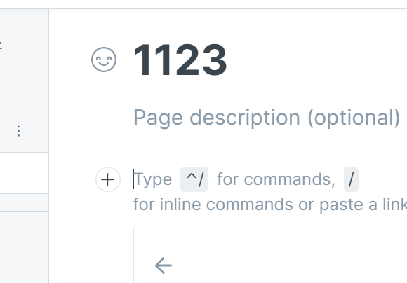

# gitbook发布的流程整理第一版

## gitbook创建一个新的仓库文档

.png>)

设置项目名称

创建README文件

创建other文件

.png>)

## github创建仓库

.png>)

## gitbook同步数据到github

.png>)

.png>)

.png>)

.png>)

.png>)

## 生成静态页面

环境准备

* nodejs环境，git环境

```
sudo apt-get install nodejs
sudo apt-get install npm
apt-get install libcurl4-gnutls-dev libexpat1-dev gettext \
  libz-dev libssl-dev -y
apt-get install git -y
nodejs升级到最新稳定版本
npm install -g n
n stable
installing : node-v18.12.1
       mkdir : /usr/local/n/versions/node/18.12.1
       fetch : https://nodejs.org/dist/v18.12.1/node-v18.12.1-linux-x64.tar.xz
     copying : node/18.12.1
   installed : v18.12.1 (with npm 8.19.2)

vim /etc/profile
export PATH=/usr/local/n/versions/node/18.12.1/bin/:$PATH

```

* npm安装gitbook-cli包

```
npm install gitbook-cli -g
```

* v2ray 科学上网工具的安装，实现终端可以访问外网

```
wget https://github.com/v2fly/v2ray-core/releases/download/v4.31.0/v2ray-linux-64.zip
修改配置文件
macbook 软件
https://github.com/yanue/V2rayU/releases

```

* 解决gitbook包的问题

```
/usr/local/n/versions/node/18.12.1/lib/node_modules/gitbook-cli/node_modules/_npm@5.1.0@npm/node_modules/graceful-fs/polyfills.js:287
      if (cb) cb.apply(this, arguments)
                 ^

TypeError: cb.apply is not a function

解决：
vim /usr/local/n/versions/node/18.12.1/lib/node_modules/gitbook-cli/node_modules/_npm@5.1.0@npm/node_modules/graceful-fs/polyfills.js

注释

// fs.stat = statFix(fs.stat)
// fs.fstat = statFix(fs.fstat)
// fs.lstat = statFix(fs.lstat)

```

在本地将github仓库代码clone下来

<pre><code><strong>git clone https://github.com/LIZEJU/c.git
</strong></code></pre>

本地创建分支

```
gitest# cd c
gitest/c# ls
di-yi.md  README.md  SUMMARY.md

gitest/c# git checkout -b pages 创建分支
切换到一个新分支 'pages'

gitest/c# git branch 当前所在的分支
  main
* pages

主分支 main
静态页面分支 pages
```

生成静态页面，且上传静态页面到对应的分支

```
#!/bin/bash

export ALL_PROXY=socks5://127.0.0.1:1080
export http_proxy=http://127.0.0.1:1087
source /etc/profile

git config credential.helper store # 只有第一次上传需要密码，之后不需要
path1="home/l/桌面/markdown1/gitest/c"

cd $path1
git checkout main
git fetch --all
git reset --hard origin/main
git pull 


gitbook build

git add .
git commit -m "main"
git push -u origin main

git checkout pages

git fetch --all

git reset --hard origin/main

git pull origin pages

cat >.gitignore<<EOF
*.md
*~
_book
.DS_Store
EOF


cp -r _book/* .
rm -rf *.md
git add .
git commit -m "1"
git push -u --force  origin pages

```

.png>)

## github.io 配置


.png>)



在action这里可以看到github正在对pages分支下的静态页面进行部署

.png>)

.png>)

访问地址：[https://lizeju.github.io/c/](https://lizeju.github.io/c/)

 (1).png>)

## test


.png>)
